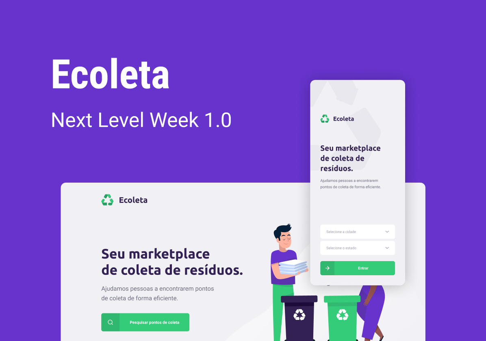

# :recycle: Ecoleta
The **Ecoleta** is an application that helps people find the nearst collection points.

This project was developed during the **Next Level Week 1.0** by **[Rocketseat :rocket:](https://github.com/Rocketseat)**.

# :hammer: Dependencies
- [node.js](https://nodejs.org/)
- [express](https://www.npmjs.com/package/express)
- [typescript](https://www.npmjs.com/package/typescript)
- [celebrate](https://www.npmjs.com/package/celebrate)
- [cors](https://www.npmjs.com/package/cors)
- [knex](https://www.npmjs.com/package/knex)
- [multer](https://www.npmjs.com/package/multer)
- [sqlite3](https://www.npmjs.com/package/sqlite3)

# :checkered_flag: Getting started
Just run `npm run dev` :slightly_smiling_face:.

# :memo: License
- [MIT license](https://opensource.org/licenses/MIT)